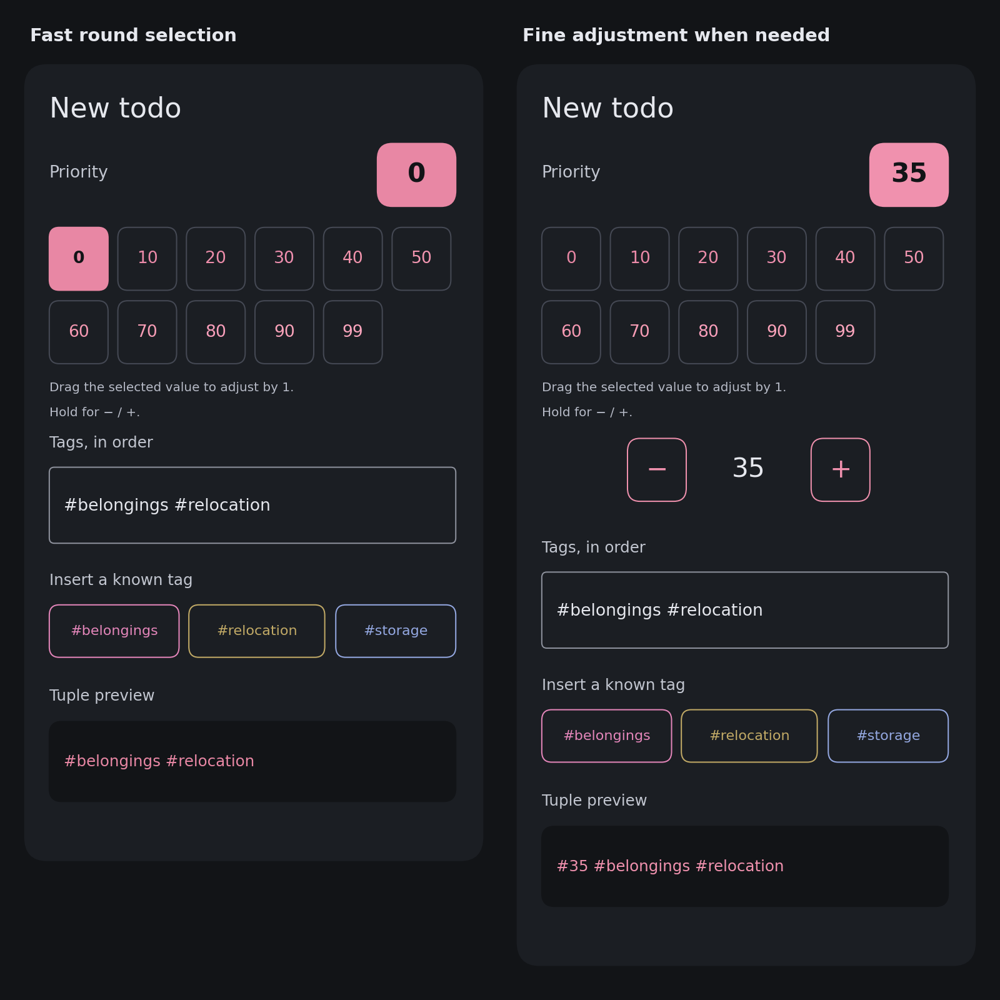
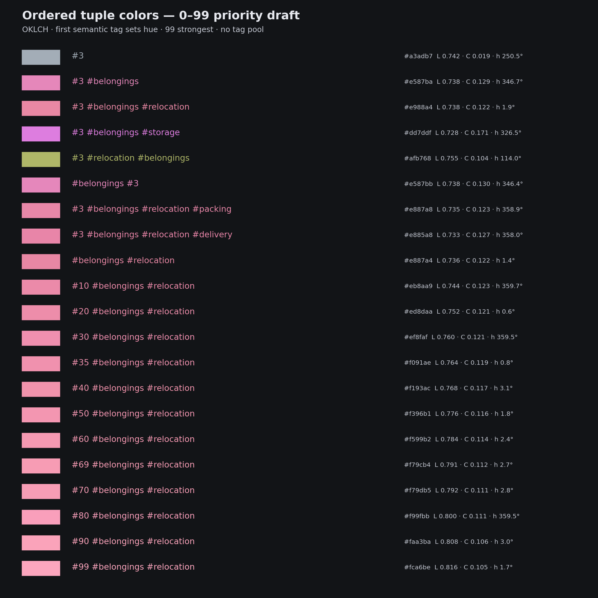

# Ordered tuple colors and the 0–99 priority picker

Status: implemented in Android 0.5.0; palette updated in 0.6.0 to reserve age hues. The images/HTML are earlier design
illustrations; use the APK for hands-on validation. See ../0.5.0-validation.md.

The user requested stable, pool-independent colors for ordered tag tuples,
visible prefix relationships and unified tuple labels. Known-tag suggestions
keep individual primary colors. Numeric tags become a separate priority
control, stored in Markdown as tags. Priority defaults to 0; 99 is strongest.
The user confirmed: new entries omit default #0, nonzero priorities come first,
and existing priority tags are updated in their current position.

## Picker



- Main control: two rows of 48dp-or-larger buttons: 0, 10, 20, 30, 40, 50 /
  60, 70, 80, 90, 99. A tap selects immediately. On narrow screens use more
  rows to preserve tap targets.
- An always-visible selected-value pill shows the exact value, including
  values such as 35 and 69. Only exact matches highlight a coarse button;
  selecting 35 must not claim that 30 or 40 is selected.
- Drag the selected-value pill horizontally: approximately 8dp per integer
  step; left decreases, right increases. Capture the starting value once,
  clamp to 0–99, and use horizontal gesture slop so normal vertical scrolling
  remains possible. Native implementation uses density-independent distances.
- Long-press (about 450ms) reveals secondary − / exact value / + controls.
  Tapping the exact-value pill can also reveal them for discoverability.
  Coarse selection dismisses these controls. The exact controls occupy space
  only when shown. No confirmation button; changes immediately update the draft.
- Examples: tap 30, drag five steps right for 35; tap 70, drag one step left
  for 69. Secondary buttons and accessibility actions change by one.
- Expose the value/range and increase/decrease/set-value accessibility actions;
  do not require a drag or long-press to use it with TalkBack.
- Colors on round-value buttons preview the current semantic tuple at that
  priority. Without semantic tags, use a quiet neutral tint/brightness scale.
  The exact selected value remains the primary source of rank information.

[Interactive HTML draft](priority-picker.html) demonstrates priority selection
for a fixed semantic tuple. Known-tag chips and the bottom tuple preview are illustrative; the bottom
preview is not a proposed extra editor field.
It does not write a document. JavaScript syntax was checked; a browser gesture
run was unavailable because the cloud machine has no Playwright browser binary.
Actual Android gesture behavior is implemented; physical-device checks remain.

## Markdown and editing

- A numeric priority tag has a digits-only identifier (Unicode decimal digits
  are accepted). Signs, decimal points and slashes make ordinary semantic tags.
  Thus #35 and #٣٥ are priority tags; #3.5 and #1/2 are semantic tags.
- Read the first numeric tag as priority. If several occur, retain the other
  tokens and their order; they contribute to the color fingerprint but do not
  add multiple priorities together. Numeric tags are excluded from known-tag
  suggestions regardless of their position or value.
- No numeric tag means priority 0. Values outside 0–99 display/color as 99;
  parse with saturation to avoid integer overflow. Preserve the original token
  until the user changes priority. Existing #9 means 9, with no automatic
  rescaling to 90 or 99.
- New ordinary entries: priority 0 adds no token; nonzero priority is inserted
  first, e.g. (#35 #belongings #relocation).
- Existing entries: the priority control replaces the first numeric token in
  its current tuple position. Selecting 0 writes #0 in that position, preserving
  the slot and preventing another numeric token from becoming the priority.
  If there was no priority token, a newly selected nonzero priority is prepended.
- The normal Tags field represents the remaining ordered tokens; the priority
  token is managed separately. Retain its insertion index while editing a draft,
  clamped to the remaining tuple length if tags are removed. Keep all other tag
  spelling, order and duplicates. No automatic cleanup of numeric duplicates.
- Anchored creation prefills the resolved priority along with editable tags.
  Priority is part of inheritance; changing it propagates through existing ^^^
  descendants exactly like other tag edits. Existing insertion/movement/deletion
  and minimal stale-source guards remain the document mutation mechanism.
- This proposal adds no new sorting mode. Existing tuple sorting still compares
  textual tokens lexicographically; it does not become numeric priority sorting.

## Deterministic color protocol

Inputs are the exact ordered effective tuple, including # and duplicate tokens.
No Unicode normalization, case folding, sorting or global tag-pool lookup.
Known semantic tag primary color is color([tag]); every displayed full tuple
uses color(tuple) uniformly. An inherited ^^^ label uses its resolved tuple's
color. Todo body text retains the normal readable text color.

Use the standalone [reference implementation](tuple-colors-reference.py).
Freeze the protocol constants/seeds when adopting it; intentional future
protocol changes would change existing colors.

### Hashing

For each component t:

```
D(t) = SHA256(UTF8("muh-todo:tuple-color:v1\0") || UTF8(t))
u[k] = (unsigned_big_endian_64(D[8*k : 8*k+8]) >> 11) / 2^53
v[k] = 2*u[k] - 1
```

SHA-256 provides stable mixing for short, similar strings and Unicode. It
avoids runtime-dependent hashes. The four non-overlapping words provide the
major hue and independent perturbation inputs. The 53-bit conversion is
specified explicitly for portable floating-point behavior.

For ordinary semantic tags only, maintain a prefix seed:

```
R_initial = SHA256(UTF8("muh-todo:semantic-path:v1"))
R_next = SHA256(R_previous || D(t))
```

Both concatenated values are fixed-size digests. Excluding numeric values from
this semantic seed keeps the semantic refinements stable while moving the
priority picker; numeric spelling/position has a separate small contribution.
Reordering semantic tags changes the prefix seed and often the major hue.

### Priority and base color

```
p = clamp(first_numeric_value_or_0, 0, 99) / 99
L = 0.74 + 0.08*p
q = 0.62 + 0.24*p
```

q is the fraction of the available sRGB chroma, not absolute OKLCH chroma.
Increasing priority increases base lightness and relative saturation; gamut
shape can make absolute chroma decrease as lightness rises.

The first semantic tag establishes the major hue h = 145 + 150*u[0], with small
base variations L += 0.008*v[2] and q += 0.03*v[3]. A numeric-only tuple uses
h = 250 degrees and low chroma C = 0.018 + 0.022*p: no semantic hue family
exists yet, so its gray tint gains a family when a semantic tag is appended.

### Semantic specialization

Let j be semantic depth: the first ordinary tag is depth 0, its child depth 1.
Priority tags do not consume a semantic level.

```
w(0) = 1
w(1) = 0.35
w(2) = 0.15
w(j) = 0.07 * 0.5^(j-3), for j >= 3
```

For each subsequent semantic tag, derive u from its new prefix digest R and
normalize (2*u[1]-1, 2*u[2]-1, 2*u[3]-1) into direction d. If its length is
zero, use (1,0,0). Set magnitude m = 0.65 + 0.35*u[0], then:

```
h += 90 degrees * w(j) * m * d[0]
L += 0.05       * w(j) * m * d[1]
q += 0.20       * w(j) * m * d[2]
```

Hue carries most structural identity. Lightness and chroma provide additional
separation for siblings with similar hue directions. Normalizing the vector
avoids an accidentally near-zero refinement merely because all hash channels
happen to be small. Later refinements decrease geometrically.

For every numeric tag at its actual tuple index i, add a small fingerprint:

```
h += 2 degrees * w(i) * (2*u[1] - 1)
```

This uses the numeric token's own digest. It preserves position/spelling effects
without selecting a major hue. Moving #3 around the same semantic path changes
color slightly; changing the first semantic tag changes the major family.

### Gamut and readability

After composition, normalize hue modulo 360, clamp L to [0.70,0.88] and q to
[0.45,0.95]. For semantic tuples find Cmax(L,h), the sRGB boundary along that
OKLCH ray, then use C = q*Cmax(L,h).

Use standard OKLab-to-linear-sRGB conversion and 24 binary-search iterations
between C=0 and C=0.4. Test actual linear RGB channels in [0,1] at each step.
This reduces chroma while retaining lightness and hue, rather than clipping
out-of-gamut RGB channels. Apply sRGB transfer encoding and round to the
nearest 8-bit value with ties-to-even; only numerical-roundoff clipping is
allowed. The reference fixes the conversion coefficients and calculation order.

An Android port should use Double/StrictMath and pin golden color vectors.
Check dark text/background contrast and tinted chips explicitly when wiring
the native UI; the design reference checks opaque colors on #1B1E23.

## Probe results

Run `python3 docs/design/tuple-colors-reference.py` without external packages.
The disposable design probe checked 4,033 colors: all in sRGB gamut, with
minimum dark-background contrast 6.41:1. It also checked increasing priority
lightness across all 100 values for 100 different semantic paths, Unicode
numeric detection, clamping and both semantic/numeric order changes.

For 12 siblings under #3 #belongings, parent-to-child OKLab distances range
0.018–0.067, sibling distances 0.009–0.116. The relocation/storage example is
about 0.101 apart. Sixteen of 66 sibling pairs are below the illustrative 0.02
comparison threshold; this is not a promise that every sibling is distinguishable
at a glance. Long paths intentionally converge. The user accepted possible
color collisions; tune the constants through hands-on use without relying on
an unknown global pool or ML.



These are design-probe results, not native Android test or device results.

## Age labels (0.6.0)

The widget prepends a view-only day count, e.g. `34d`, to every entry's tag
label. It is today's local calendar date minus the Markdown section date.
Today is `0d`; future dates are negative. The full count is displayed even
beyond 60 days. This never becomes a tag or changes the Markdown document.

Nonpositive ages are white. For positive ages, `t = clamp(days, 0, 60)/60`,
`L = .98 - .22*t`, `h = 40*t`, and
`C = min(.30*t, .99*maximumChroma(L,h))`. Age hue increases towards a glaring saturated
orange; the label is bold, then caps at 60 days. Semantic roots now use `145 + 150*u[0]`;
all bounded perturbations keep tag hues above 80 degrees. This reserves the
0–60 degree range for age labels, with a gap between the two palettes, while
keeping child tuples near their prefixes. Existing tag colors change in
this version. Known-tag chips and tuple labels use the same updated protocol.
The older prototype images and HTML predate this palette update.
